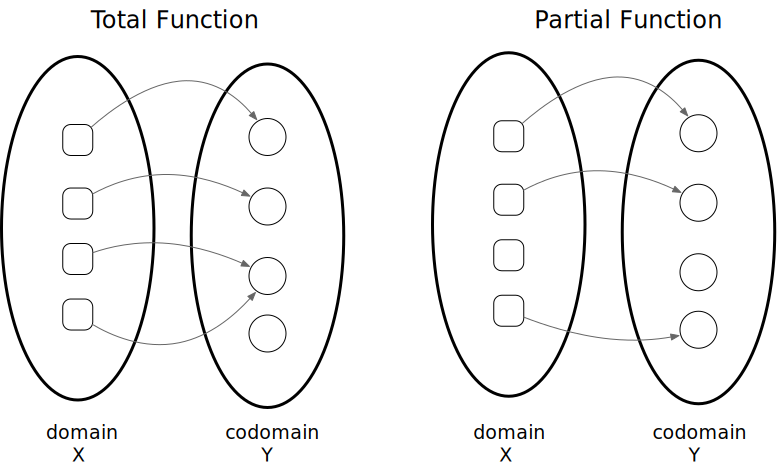
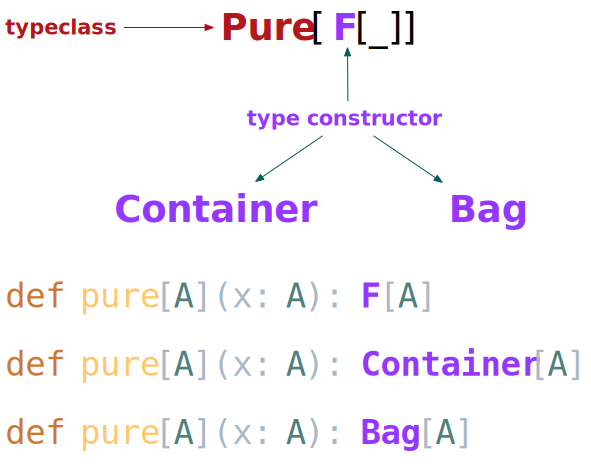
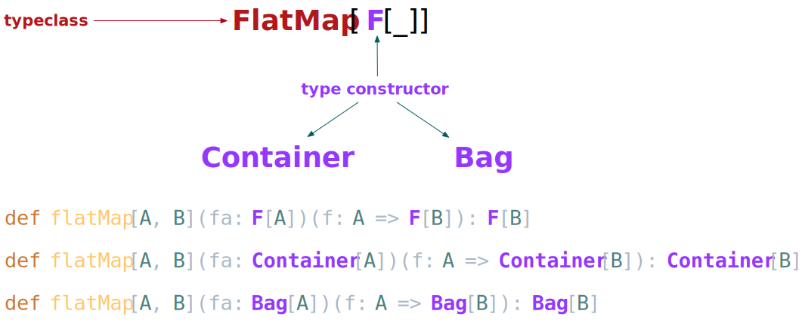
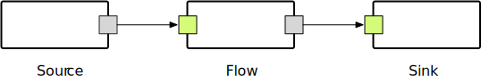
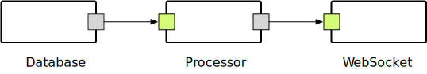

name: inverse
layout: true
class: center, middle, inverse

---

# Functional Programming
Hossam Karim .  Radwa Osama . Abdul-Rahman Salah
.footnote[[elmenus](https://www.elmenus.com)]

---

## What do we have for you today?

---

layout: false
.left-column[
  ### Functional Programming
]
.right-column[
- What is a function?
- Referential Transparency
- Laziness
- Purity 
]

---

.left-column[
  ### Functional Programming
  ### Scala
]
.right-column[
- `trait`, `class`, `object` and `type`
- Mixins
- Self-Type annotations
- `val`, `def`, `lazy` and type inference
- Generics
- Invariant, Covariant and Contravariant
- `case class`, `sealed trait` and co-products
- `Option`, `Vector` and `Future`
- Pattern Matching
- Total and partial functions
- Generic - Polymorphic - functions
- Higher-Order functions
- Currying, Multiple parameter lists and Partially applied functions
- Composing functions
- Implicit values and parameters
]

---

.left-column[
  ### Functional Programming
  ### Scala
  ### Not Enough Functions
]
.right-column[
- `map` as a member method
- Generalizing `map` in a base trait
- Externalizing `map` 
- `Functor`, type constructors and higher-kinded types
- `Functor` is a type-class
- `Functor` instances
- `pure` 
- `flatMap`
- Implementing `map` in terms of `pure` and `flatMap`
- `Monad` is a type-class
- `for` comprehension
]

---

.left-column[
  ### Functional Programming
  ### Scala
  ### Not Enough Functions
  ### Domain Modeling, Services and Effects
]
.right-column[
- Everything is in the function (signature)
- The Tale of One City
  - Value Types
  - Entities
  - Aggregates
- IO, Kleisli, Future
  - Database actions
  - Security actions 
  - Composing actions
]

---

.left-column[
  ### Functional Programming
  ### Scala
  ### Not Enough Functions
  ### Domain Modeling, Services and Effects
  ### Streaming
]
.right-column[
- Unix Pipes
- Source - Flow - Sink
- Simple file processing, map-reduce flow
- From a database source to the browser and back again - a bi-directional streaming use case using Akka Streams and Akka HTTP WebSockets
]

---

template: inverse

## Let's get started

---

layout: false
## What is a function?
$$\huge{f\colon X\mapsto Y}$$

.center[

]

---

layout: false
## What is a function?
$$\huge{f\colon X\mapsto Y}$$

.center[

]

---

layout: false
## Referential Transparency

Compare those 2 programs:

.pull-left[
```java
int i = iterator.next();
int j = i;
```
]

.pull-right[
```java
int i = iterator.next();
int j = iterator.next();
```
]

- `iterator.next()` has a **Side-Effect**
- Each time we call `next()` on an `iterator` we might get a different value

---

layout: false
## Referential Transparency

Compare those 2 programs:

.pull-left[
```java
float a = MathLib.avg(2,3,4);
float b = a;
```
]

.pull-right[
```java
float a = MathLib.avg(2,3,4);
float b = MathLib.avg(2,3,4);
```
]

- `MathLib.avg(...)` has **No Side-Effect**
- Each time we call `avg()` with a particular set of arguments, we get the same result

---

template: inverse

## Scala Programming Language

---

layout: false
## Scala
### `trait`, `class`, `object` and `type`

```scala
trait Organization

class Company extends Organization

class University extends Organization

object IBM extends Company

object AUC extends University

object TypeAlias {

  type Name = String

  type Money = Double

}
```

---

layout: false
## Scala
### Mixins
```scala
trait Organization

trait Entity

class Company extends Organization with Entity

class University extends Organization with Entity

object IBM extends Company

object AUC extends University

```

---

layout: false
## Scala
### Self-Type Annotation

```scala
trait DatabaseAccess

trait Networking

trait Service {
  self: DatabaseAccess with Networking =>
}

trait PostgresDatabaseAccess extends DatabaseAccess

trait TcpNetworking extends Networking

object MyService 
  extends Service 
  with PostgresDatabaseAccess 
  with TcpNetworking

```

---

layout: false
## Scala
### `val`, `def` and `lazy`

```scala
// name and birthDate are immutable
class Person(
  val name: String, 
  val birthDate: LocalDate) 

val p01: Person = new Person("p01", LocalDate.of(1970, 4, 15))
val p02         = new Person("p02", LocalDate.of(1988, 10, 4))
```

```scala
def show(person: Person): String =
  s"The person's name is ${person.name}"
```

```scala
lazy val localDateOnFirstCall: LocalDate = LocalDate.now()
```

---

layout: false
## Scala
### Generics

```scala
object Generics {

  trait Combiner[A] {
    def combine(left: A, right: A): A
  }

  object StringCombiner extends Combiner[String] {
    def combine(left: String, right: String): String = 
      s"$left and $right"
  }

  object IntegerCombiner extends Combiner[Int] {
    def combine(left: Int, right: Int): Int = 
      left + right
  }

}
```

---

layout: false
## Scala
### Generics

```scala
import Generics._

@tailrec 
def combineAll[A](first: A, rest: A*)(combiner: Combiner[A]): A =
  if (rest.isEmpty)
    first
  else
    combineAll(
      combiner.combine(first, rest.head),
      rest.tail:_*
    )(combiner)


def main(args: Array[String]): Unit = {

  println(combineAll(1, 2, 3, 4)(IntegerCombiner))

  println(combineAll("1", "2", "3", "4")(StringCombiner))

}
```

---

layout: false
## Scala
### Generics

.pull-left[
```scala
class Invariant[A]

class Covariant[+A]

class Contravariant[-A]
```
]

.pull-right[
```scala
trait LivingBeing

trait Animal extends LivingBeing

class Cat extends Animal
```
]

---

layout: false
## Scala
### Generics

.pull-left[
```scala
class Invariant[A]

class Covariant[+A]

class Contravariant[-A]
```
]

.pull-right[
```scala
trait LivingBeing

trait Animal extends LivingBeing

class Cat extends Animal
```
]

And Given:

```scala
def invariant(instance: Invariant[Animal]): Unit
```

Then:
```scala
//invariant(new Invariant[LivingBeing]) // will not compile
invariant(new Invariant[Animal])        // compiles
//invariant(new Invariant[Cat])         // will not compile
```

---

layout: false
## Scala
### Generics

.pull-left[
```scala
class Invariant[A]

class Covariant[+A]

class Contravariant[-A]
```
]

.pull-right[
```scala
trait LivingBeing

trait Animal extends LivingBeing

class Cat extends Animal
```
]

And Given:

```scala
def covariant(instance: Covariant[Animal]): Unit 
```

Then:
```scala
//covariant(new Covariant[LivingBeing])  // will not compile
covariant(new Covariant[Animal])         // compiles
covariant(new Covariant[Cat])            // compiles
```

---

layout: false
## Scala
### Generics

.pull-left[
```scala
class Invariant[A]

class Covariant[+A]

class Contravariant[-A]
```
]

.pull-right[
```scala
trait LivingBeing

trait Animal extends LivingBeing

class Cat extends Animal
```
]

And Given:

```scala
def contravariant(instance: Contravariant[Animal]): Unit
```

Then:
```scala
contravariant(new Contravariant[LivingBeing]) // compiles
contravariant(new Contravariant[Animal])      // compiles
//contravariant(new Contravariant[Cat])       // will not compile
```

---

layout: false
## Scala
### `case class`

```scala
case class Name(value: String)
case class Person(name: Name, birthData: LocalDate)
```
---

layout: false
## Scala
### `case class`

```scala
case class Name(value: String)
case class Person(name: Name, birthData: LocalDate)
```

```scala
val p01 = Person(Name("p01"), LocalDate.of(1980, 11, 12))
val p02 = Person(Name("p02"), LocalDate.of(1980, 11, 12))
```
---

layout: false
## Scala
### `case class`

```scala
case class Name(value: String)
case class Person(name: Name, birthData: LocalDate)
```

```scala
val p01 = Person(Name("p01"), LocalDate.of(1980, 11, 12))
val p02 = Person(Name("p02"), LocalDate.of(1980, 11, 12))
```

```scala
p01.copy(name = Name("p02")) == p02 // true
```

```scala
p01.productIterator.mkString(", ") // Name(p01), 1980-11-12
```
---

layout: false
## Scala
### Pattern Matching

```scala
case class Name(value: String)

trait LivingBeing {
  def name: Name // notice Scala uniform access
}

case class Person(name: Name, birthData: LocalDate) extends LivingBeing
case class Animal(name: Name) extends LivingBeing
```

```scala
def classify(being: LivingBeing): String = being match {
  case Person(n, bd) => s"a person called: ${n.value} born ${bd.toString}"
  case Animal(n)     => s"an animal called: ${n.value}"
  case _             => s"a living being called: ${being.name.value}"
}
```
---

layout: false
## Scala
### Higher-Order Functions

Remember this one?

```scala
trait Combiner[A] {
  def combine(left: A, right: A): A
}

object StringCombiner extends Combiner[String] {
  def combine(left: String, right: String): String = s"$left and $right"
}

object IntegerCombiner extends Combiner[Int] {
  def combine(left: Int, right: Int): Int = left + right
}

def combineAll[A](first: A, rest: A*)(combiner: Combiner[A]): A =
  if (rest.isEmpty)
    first
  else
    combineAll(
      combiner.combine(first, rest.head),
      rest.tail:_*
    )(combiner)
```
---
layout: false
## Scala
### Higher-Order Functions

Tadaaaaaaaaaaaaaaaaaaaaaaaaaaa

```scala
def combineAll[A](first: A, rest: A*)(combine: (A, A) => A): A =
  rest.foldLeft(first)(combine)
```

What is `foldLeft`?

```scala
def foldLeft[B](z: B)(op: (B, A) => B): B
```
---

layout: false
## Scala
### Higher-Order Functions

What is `foldLeft`?

```scala
def foldLeft[B](z: B)(op: (B, A) => B): B
```

Example:
```scala
val schedule = List("had breakfast", "went to RiseUp") 

val folded = 
  schedule
    .foldLeft("woke up early")( (accumulator, next) => s"$accumulator then $next")
```

Then `folded` value is:
```scala
"woke up early then had breakfast then went to RiseUp"
```

---

layout: false
## Scala
### Companion Objects

```scala
// Company trait
trait Company {
  def name: String
}

// Company companion object
object Company {

  def apply(companyName: String): Company = new Company {
    def name: String = companyName
  }

}

val c01 = Company.apply("c01") // invoke `apply` explicitly
val c02 = Company("c02")       // invoke `apply` also, syntactic sugar

```

---

layout: false
## Scala
### Let's build a Binary Search Tree


A `Tree` in Haskell:
```haskell
data Tree a = Empty | Leaf a | Node (Tree a) a (Tree a)
```
Yeah, that's it! But,

A `Tree` in Scala:
```scala
sealed trait Tree[+A]

case class Node[+A](data: A, left: Tree[A], right: Tree[A]) extends Tree[A]

case class Leaf[+A](data: A) extends Tree[A]

case object Empty extends Tree[Nothing]
```
---

layout: false
## Scala
### Let's build a Binary Search Tree

The `insert` function:
```scala
def insert[A](tree: Tree[A], data: A)
             (ordering: Ordering[A]): Tree[A] = tree match {

  case Empty         =>
    Leaf(data)

  case Leaf(a)       =>
    if (ordering.compare(data, a) < 0)
      Node(a, Leaf(data), Empty)
    else
      Node(a, Empty, Leaf(data))

  case Node(a, l, r) =>
    if (ordering.compare(data, a) < 0)
      Node(a, insert(l, data)(ordering), r)
    else
      Node(a, l, insert(r, data)(ordering))

}
```
---

layout: false
## Scala
### Let's build a Binary Search Tree


Walk the `Tree` `inOrder`, sorting the `Tree`:
```scala
def inOrder[A](tree: Tree[A]): List[A] = tree match {
  case Empty         => List.empty[A]
  case Leaf(a)       => List(a)
  case Node(a, l, r) => inOrder(l) ++ List(a) ++ inOrder(r)
}
```

---
layout: false
## Scala
### Let's build a Binary Search Tree

The `insert` function *REVISITED*. Can you spot the changes?
```scala
def insert[A](tree: Tree[A], data: A)
             (implicit ordering: Ordering[A]): Tree[A] = tree match {

  case Empty         =>
    Leaf(data)

  case Leaf(a)       =>
    if (ordering.compare(data, a) < 0)
      Node(a, Leaf(data), Empty)
    else
      Node(a, Empty, Leaf(data))

  case Node(a, l, r) =>
    if (ordering.compare(data, a) < 0)
      Node(a, insert(l, data), r)
    else
      Node(a, l, insert(r, data))

}
```

---
template: inverse
## Not Enough Functions!
---

layout: false
#### `map` Trial 01 | What's wrong with this?

.pull-left[
```scala
trait Container[A] {
  def map[B](f: A => B): Container[B]
}

trait Bag[A] {
  def map[B](f: A => B): Bag[B]
}
```
]

.pull-right[
```scala
def container: Container[Int] = ???
def bag: Bag[String] = ???
```
]

Having:

```scala
def change[A, B](instance: Container[A])(f: A => B): Container[B] = 
  instance.map(f)
def change[A, B](instance: Bag[A])(f: A => B): Bag[B] = 
  instance.map(f)
```

Then:
```scala
change(container)(_ + 1)
change(bag)(string => s"here is your $string")
```

---

layout: false
#### `map` Trial 02 | What's wrong with this?


```scala
trait Mapped[A] {
  def map[B](f: A => B): Mapped[B]
}

trait Container[A] extends Mapped[A]

trait Bag[A] extends Mapped[A]
```

Then:
```scala
change(container)(_ + 1)
change(bag)(string => s"here is your $string")
```

---

layout: false
#### `map` Trial 03 | What's wrong with this?


```scala
trait Functor[F[_]] {
  def map[A, B](fa: F[A])(f: A => B): F[B]
}

trait Container[A]

trait Bag[A]

def change[F[_], A, B]
  (instance: F[A])(f: A => B)
  (functor: Functor[F]): F[B] = functor.map(instance)(f)
```

And:

```scala
def containerFunctor: Functor[Container] = ???
def bagFunctor: Functor[Bag] = ???
```

Then:
```scala
change(container)(_ + 1)(containerFunctor)
change(bag)(string => s"here is your $string")(bagFunctor)
```

---

layout: false
#### `map` Trial 04 | What's wrong with this?


```scala
trait Functor[F[_]] {
  def map[A, B](fa: F[A])(f: A => B): F[B]
}

trait Container[A]

trait Bag[A]

def change[F[_], A, B]
  (instance: F[A])(f: A => B)
  (implicit functor: Functor[F]): F[B] = functor.map(instance)(f)

```

And:

```scala
implicit def containerFunctor: Functor[Container] = ???
implicit def bagFunctor: Functor[Bag] = ???
```

Then:
```scala
change(container)(_ + 1)
change(bag)(string => s"here is your $string")
```

---

layout: false
### What about `flatMap`?

```scala
def flatMap[B](f: A => Option[B]): Option[B]
```

Example:

```scala
Some(1).flatMap(i => Some(i + 1))               // Some(2)

Option.empty[Int].flatMap(i => Some(i + 1))     // None
```

---

layout: false

### What about `flatMap`?

```scala
def flatMap[B](f: A => List[B]): List[B]  // simplified
```

Example:

```scala
List(1,2,3).flatMap(i => List(s"number $i", s"número $i", s"nombre $i")) 
// List(
//      number 1, número 1, nombre 1, 
//      number 2, número 2, nombre 2, 
//      number 3, número 3, nombre 3)

List.empty[Int].flatMap(i => List(s"number $i", s"número $i", s"nombre $i"))
// List()
```
---
template: inverse
## Getting Serious

---

layout: false
### Functor
.center[

]

---

layout: false
### Pure
.center[

]

---

layout: false
### FlatMap
.center[

]

---
template: inverse
## Functional Data Access
Getting Ready for the Real World

---

layout: false
## Data Access
### IO

```scala
lazy val db: Database = Database.forConfig("db.elmenus", configuration)

// create an action to be performed on the database
// we are not running the action here
val io: DBIO[Vector[Int]] = sql"select 1".as[Int]

// run the action, i.e. perform IO
val f: Future[Vector[Int]] = db.run(io)

// register a callback when the IO is done
f.onComplete {
  case Success(v) => println(v)
  case Failure(e) => e.printStackTrace()
}

// block until we get the result back
// do not do this in your code
Await.result(f, Duration.Inf)

// clean up
db.close()

```
---

layout: false
## Data Access
### Callback Hell

```scala
val createAccountTable: DBIO[Int] =  
  sqlu"create table if not exists account(id bigint, email varchar(255))"

def insertAccount(account: Account): DBIO[Int] = 
  sqlu"insert into account values (${account.id}, ${account.email})"

val findAllAccounts: DBIO[Vector[Account]] = 
  sql"select id, email from account".as[Account]

val dropAccountTable: DBIO[Int] = 
  sqlu"drop table account"

```

We need to:
- create the `Account` table
- insert an `Account`
- get all `Account`s
- drop the table
---

layout: false
## Data Access
### Callback Hell

```scala
createAccountTable.flatMap { _ =>
    insertAccount(account)
      .flatMap { _ =>
          findAllAccounts
            .flatMap { accounts =>
                dropAccountTable
                  .map { _ =>
                      accounts
                  }
            }
      }
}

```

We need to:
- create the `Account` table
- insert an `Account`
- get all `Account`s
- drop the table

---

layout: false
## Data Access
### `for` Comprehension

```scala
for {
  _        <- createAccountTable
  _        <- insertAccount(account)
  accounts <- findAllAccounts
  _        <- dropAccountTable
} yield accounts

```

We need to:
- create the `Account` table
- insert an `Account`
- get all `Account`s
- drop the table

---
template: inverse
## Streaming Data
---
layout: false
### Source - Flow - Sink
.center[

]

---

layout: false
### Source - Flow - Sink
.center[

]

Source
```scala
val citySource =
  Source
    .fromPublisher(
      postgres.stream(sql"select * from city limit 100".as[City]))
```

Flow
```scala
val cityFlow = Flow[City].map(_.asJson.noSpaces)
```

Sink
```scala
val citySink = Sink.foreach[String](println)
```

---

layout: false
### Source - Flow - Sink
.center[

]

Wire it together
```scala
val graph = citySource.via(cityFlow).to(citySink)
```

---

layout: false
### Example - Streaming WebSocket
.center[

]

---

layout: false
### Example - Streaming WebSocket
.center[

]

Source
```scala
// data source, populated from DB
val city: Source[City, Any] =
  Source
    .fromPublisher(
      postgres.stream(
        sql"select id, name, countrycode, district, population from city"
          .as[City]))

// map City into WebSocket TextMessage
def map(city: City): Message =
  TextMessage(city.asJson.noSpaces)

// construct the websocket source
def source: Source[Message, Any] =
  city
    .map(map)
    .delay(1.second, DelayOverflowStrategy.backpressure)
```
---

layout: false
### Example - Streaming WebSocket
.center[

]

Flow
```scala
// construct the WebSocket flow
val cityWebSocketFlow: Flow[Message, Message, Any] =
  Flow[Message]
    .flatMapConcat(_ => source)
```
---

layout: false
### Example - Streaming WebSocket
.center[

]

Sink
```scala
val route =
  pathPrefix("city") {
    pathEndOrSingleSlash {
      handleWebSocketMessages(cityWebSocketFlow)
    }
  }

val bindingFuture = Http().bindAndHandle(route, ip, port)
```
---

template: inverse

## Talk to us

---
name: last-page
template: inverse

## That's all folks! Thank You

Code, Slides and Goodies @ https://github.com/hkarim/riseup-summit-2017
